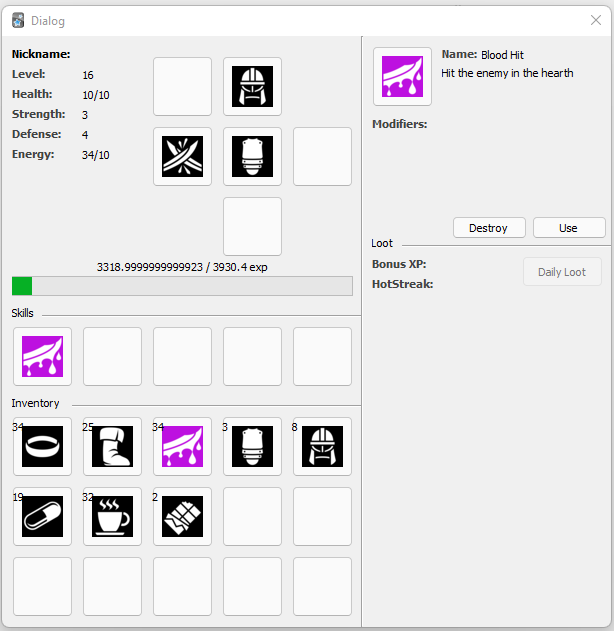

# Anki RPG

Simple local RPG turn-based to play while learn something using the anki system. Today this addon keeps in development.

- A `study` is a way to restore energy and helgth. 
- When you finish your `study` you can find a simple lot and receive some items.
- You can fight with mobs to receive more lot and xp but is going to descrease your energy.

## Versions
Moved to https://github.com/raphaelkieling/addon-anki-rpg/projects/1

## References:
I'm not from the game dev world, so it's comprehensible that I need to study to create this plugin.

- https://gamedevelopment.tutsplus.com/articles/designing-an-rpg-inventory-system-that-fits-echoes-of-eternea--gamedev-14947
- https://github.com/sivenchinniah/Pokemanki/blob/bafc6940b56c46b8f59f5ac0e228c0c37cadd558/utils.py#L23
- https://softwareprocess.es/homepage/posts/stats-for-games/
- https://www.youtube.com/watch?v=d7L0em4ik3M&list=TLPQMDEwNDIwMjCCanyLpLMh1A
- https://medium.com/@guilhermegm/unity-simple-loot-system-d181220e6542
- https://game-icons.net/
- https://www.youtube.com/watch?v=OUlxP4rZap0
- https://rpg.fandom.com/wiki/Damage_Formula
