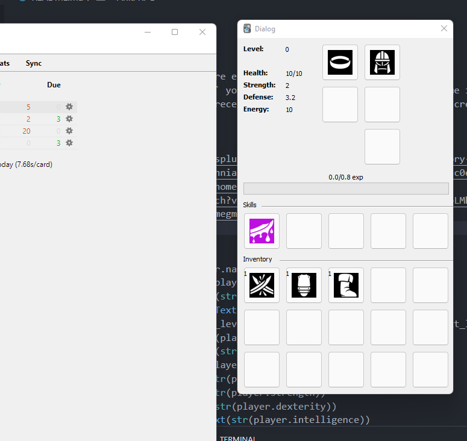

# Anki RPG

Descriptions:
- A `study` is a way to restore energy and helgth. 
- When you finish your `study` you can find a simple lot and receive some items.
- You can fight with mobs to receive more lot and xp but is going to descrease your energy.

## Features
> v0.0.1


- [x] Inventory
- [x] Weapon item
- [x] Acessory item
- [x] Head item
- [x] Body item
- [x] Leg item
- [x] Consumable items like health pots
- [x] Skill item
- [x] Allow item to be a kills usable
- [x] Equip and unequip items
- [x] Simple loot system using change by item in the loot box
- [x] Level up
- [x] Use pokemon exp progress (the simplest one)
- [] Increase EXP with the study
- [] Decrease with errors
- [] Lot after a session study
- [] Better lot depending of the cards studied
- [] Turn based battles!
- [] Dices animation (or sprites)

Refs:
- https://gamedevelopment.tutsplus.com/articles/designing-an-rpg-inventory-system-that-fits-echoes-of-eternea--gamedev-14947
- https://github.com/sivenchinniah/Pokemanki/blob/bafc6940b56c46b8f59f5ac0e228c0c37cadd558/utils.py#L23
- https://softwareprocess.es/homepage/posts/stats-for-games/
- https://www.youtube.com/watch?v=d7L0em4ik3M&list=TLPQMDEwNDIwMjCCanyLpLMh1A
- https://medium.com/@guilhermegm/unity-simple-loot-system-d181220e6542
- https://game-icons.net/

```py
self.label_name.setText(player.name)
self.label_level.setText(str(player.level))
self.label_experience.setText(str(player.experience))
self.label_experience_max.setText(str(player.experience_max))
self.label_experience_to_next_level.setText(str(player.experience_to_next_level))
self.label_health.setText(str(player.health))
self.label_health_max.setText(str(player.health_max))
self.label_mana.setText(str(player.mana))
self.label_mana_max.setText(str(player.mana_max))
self.label_strength.setText(str(player.strength))
self.label_dexterity.setText(str(player.dexterity))
self.label_intelligence.setText(str(player.intelligence))
self.label_luck.setText(str(player.luck))
self.label_speed.setText(str(player.speed))
self.label_damage.setText(str(player.damage))
self.label_armor.setText(str(player.armor))
self.label_critical_chance.setText(str(player.critical_chance))
self.label_critical_damage.setText(str(player.critical_damage))
self.label_block_chance.setText(str(player.block_chance))
self.label_block_damage.setText(str(player.block_damage))
self.label_resistance_fire.setText(str(player.resistance_fire))
self.label_resistance_ice.setText(str(player.resistance_ice))
self.label_resistance_lightning.setText(str(player.resistance_lightning))
self.label_resistance_poison.setText(str(player.resistance_poison))
self.label_resistance_physical.setText(str(player.resistance_physical))
```
